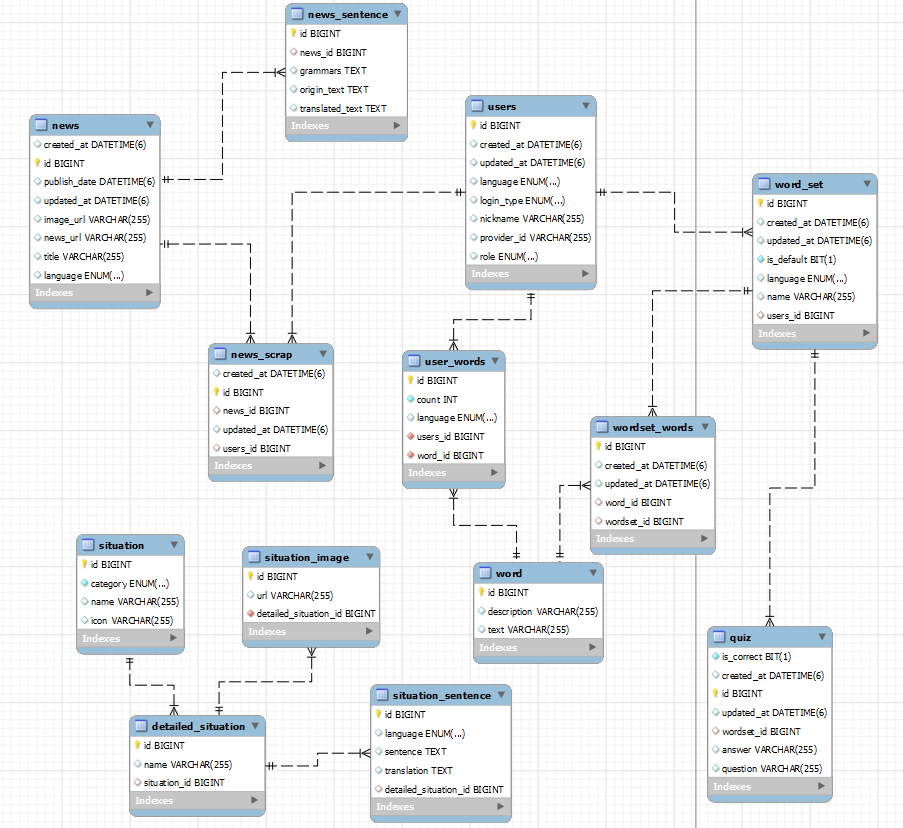
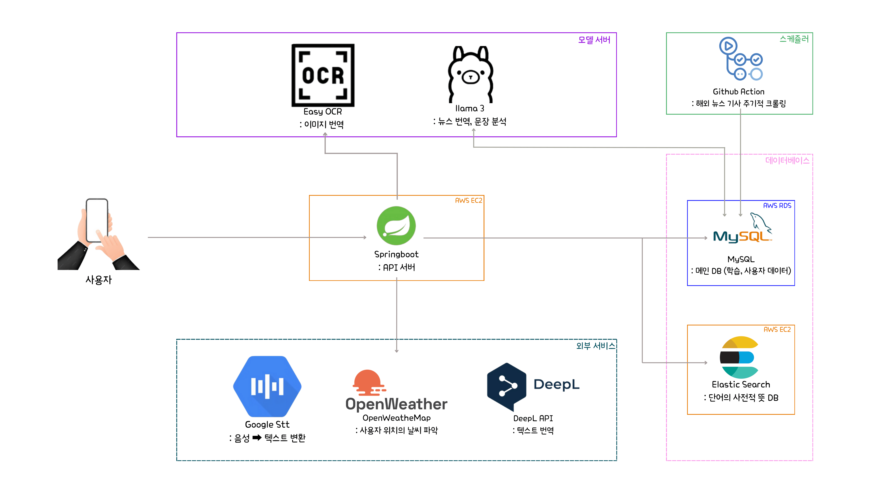
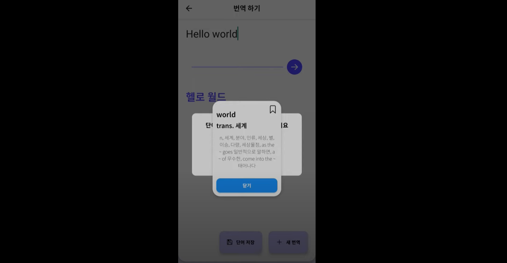

# Polingo : 다국어 번역/학습 플랫폼

## ✨ 프로젝트 개요

Polingo는 언어 학습의 모든 측면을 하나로 통합한 종합 학습 플랫폼입니다.

단순한 단어 암기를 넘어, 실생활에서 사용되는 상황별 표현과 실제 뉴스를 통한 다채롭게 언어를 배울 수 있습니다.

영어와 일본어 학습에 특화되어 있으며, 사용자의 학습 패턴과 관심사에 맞춰 개인화된 학습 경험을 제공합니다.

 

## 🚀 주요 기능

### 단어 학습 시스템
- 개인 맞춤형 단어장 생성 및 관리
- 단어장 기반 단어 퀴즈를 통한 개인화된 학습 지원
- 뉴스, 번역 등의 출처에 대한 단어의 사전적 의미 조회 지원

### 상황별 예문 학습
- 날씨, 시간, 장소 등 다양한 상황별 예문 제공
- 실제 생활에서 활용 가능한 실용적인 문장 학습

### 뉴스 기반 학습
- 외국어 뉴스 기사를 통한 실제 언어 사용 학습
- 문장별 번역 및 문법 설명 제공

### 번역 서비스
- 텍스트, 음성, 이미지를 통한 다양한 번역 기능
- DeepL API를 활용한 고품질 번역 제공

### 단어장 관리 시스템
- 언어별 기본 단어장 자동 생성
- 사용자 정의 단어장 생성 및 관리
- 단어장 간 단어 이동 및 복사 기능

### 사용자 관리
- OAuth2 기반 소셜 로그인(Google, Kakao)
- 사용자 설정(기본 언어, 닉네임 등)

 

## 🛠️ 기술 스택
### Backend
- Java 17
- Spring Boot 3.2.2

### Infra
- MySQL 8.0
- Elasticsearch 8.13.4

### External API
- Google Cloud Speech-to-Text
- DeepL Translator API
- OpenWeatherMap API

### Build Tools
- Gradle 8.5

 

## 📊 E-R Diagram

 

## 🏛️ Architecture
Polingo는 `SpringBoot` 기반 백엔드 서버를 중심으로, `MySQL`과 `Elasticsearch`를 데이터 저장소로 활용합니다.
또한, 다양한 언어 학습 기능을 위해 여러 외부 서비스 및 AI 모델과의 연동이 진행됩니다.

### 핵심 구성요소
<table>
  <tr>
    <th width="120">구분</th>
    <th width="150">기술</th>
    <th>역할</th>
  </tr>
  <tr>
    <td><b>API 서버</b></td>
    <td><code>SpringBoot</code></td>
    <td>RESTful API 제공, 비즈니스 로직 처리</td>
  </tr>
  <tr>
    <td rowspan="2"><b>데이터 저장</b></td>
    <td><code>MySQL</code></td>
    <td>사용자/학습 데이터 저장 및 관리</td>
  </tr>
  <tr>
    <td><code>Elasticsearch</code></td>
    <td>단어 사전 및 검색 최적화 저장소</td>
  </tr>
  <tr>
    <td rowspan="2"><b>AI 모델</b></td>
    <td><code>Easy OCR</code></td>
    <td>이미지 텍스트 인식</td>
  </tr>
  <tr>
    <td><code>Llama 3</code></td>
    <td>뉴스 번역 및 문장 분석</td>
  </tr>
  <tr>
    <td rowspan="3"><b>외부 API</b></td>
    <td><code>Google STT</code></td>
    <td>음성을 텍스트로 변환</td>
  </tr>
  <tr>
    <td><code>OpenWeatherMap</code></td>
    <td>위치 기반 날씨 정보 제공</td>
  </tr>
  <tr>
    <td><code>DeepL</code></td>
    <td>텍스트 번역</td>
  </tr>
  <tr>
    <td><b>스케줄러</b></td>
    <td><code>GitHub Actions</code></td>
    <td>뉴스 기사 자동 크롤링</td>
  </tr>
</table>

이러한 구성을 통해 단어 학습, 뉴스 기반 학습, 상황별 예문 학습, 다양한 형태의 번역 등을
통합적으로 제공합니다.

 

## 📺시연 영상
